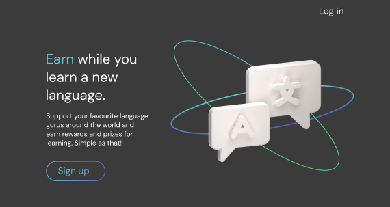

<!-- PROJECT LOGO -->
 

  

<h3 align="center">Lingo Learning Platform</h3>

  

    I'm developing a Web3 DApp for the 2022 Chainlink hackathon. Right now I'm working on the front-end of the project and will dive into web3 technologies to build a revoluntary language learning platform.
  

<!-- ABOUT THE PROJECT -->

## About The Project

Learning a language can be hard. Very hard. Why not make it a more engaging and uplifting experience by rewarding learners to learn a new language. Think of it as the new Patreon subscription service crossed with Duolingo and Babbel, with a focus on giving back 100% of earnings to creators.
 
 
This proof of concept will allow learners to earn crypto rewards for subscribing and engaging with language influencers on the platform through competitions, giveaways and more. Creators will be given 100% of the earnings, nothing like Patreon or Youtube taking up to 50%!
 
 
This concept will be supported with a 'Lingo coin' currency that can be converted to other major crypto. At this stage, the project is north star, especially with my lack of web3 experience. Hopefully by the end of the Chainlink hackathon I'll have a working proof of concept.

### Built With so far

- [React.js](https://reactjs.org/)
